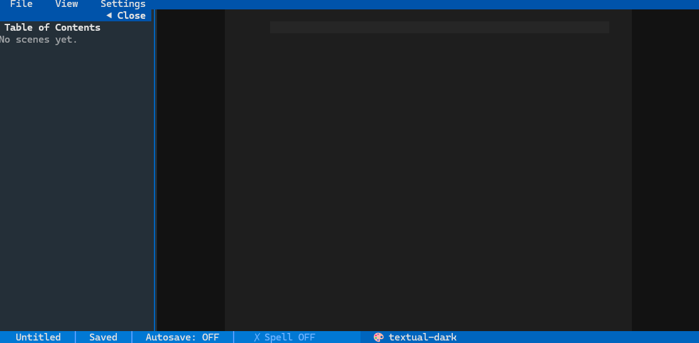
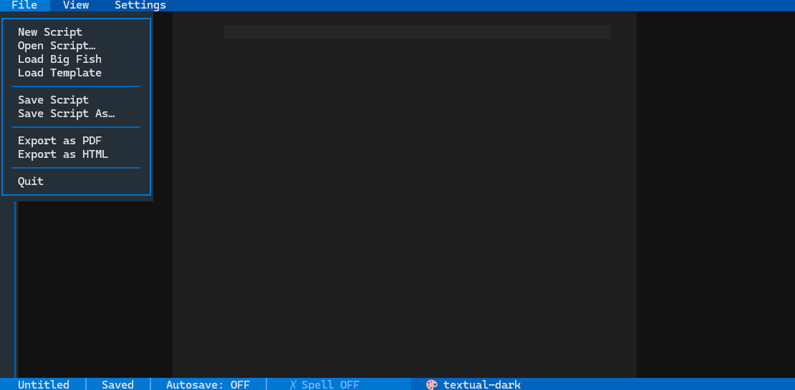
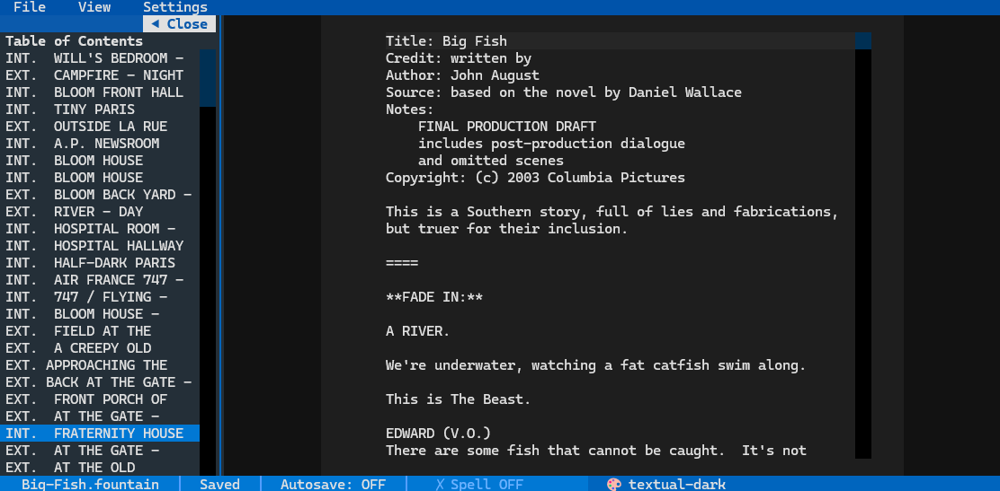
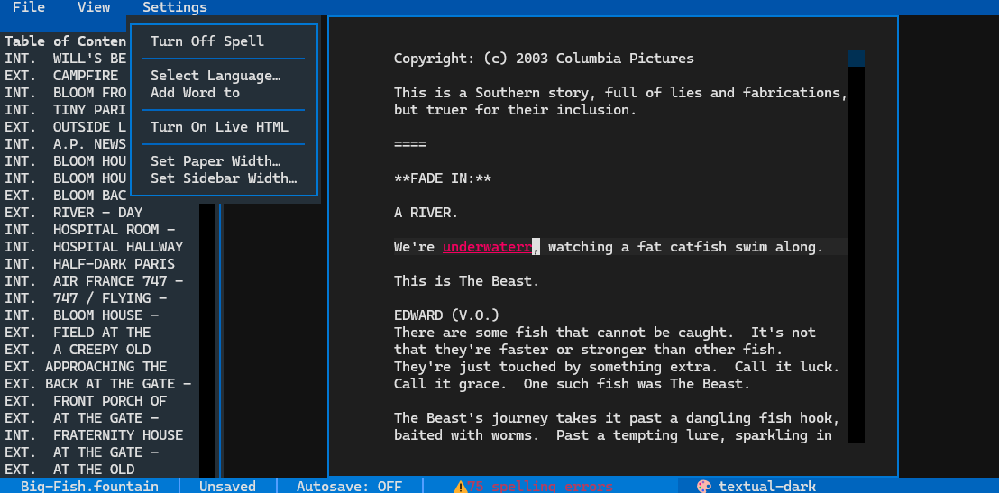

# Screenply

A terminal-based screenwriting app built with Python and [Textual](https://github.com/Textualize/textual).

## Screenshots






## Tech

- **Python 3.10+**
- **Textual** — TUI framework (widgets, reactive state, themes, modal screens)

## Run

```bash
python makevenv.py
.venv\Scripts\activate
pip install -r requirements.txt
python main.py
```

## Current features

- Menu bar with **File**, **View**, and **Settings** dropdown menus
- **File** menu: New, Open, Save, Save As, Export PDF/HTML, Load Big Fish example, Load Template, Quit
- **View** menu: toggle between **Paper View** (fixed-width column) and **Web View** (full-width)
- **Settings** menu: spell check on/off, language picker, add word to dictionary, live HTML preview, set paper width, set sidebar width
- Collapsible **sidebar** with live **Table of Contents** — auto-generated from Fountain scene headings, clickable to jump to scene
- **Status bar** with filename, save status, and autosave indicator
- **Theme picker** — click 🎨 in the status bar to choose from built-in themes
- **Spell checker** with red underline highlights and per-language user dictionaries
- **Live HTML preview** — auto-rebuilds in the browser as you type
- **Export** to PDF and HTML via screenplain

## Fountain format

Scene headings are detected automatically (`INT.`, `EXT.`, `INT./EXT.`, forced with `.`).
The editor follows standard [Fountain](https://fountain.io) markup conventions.
